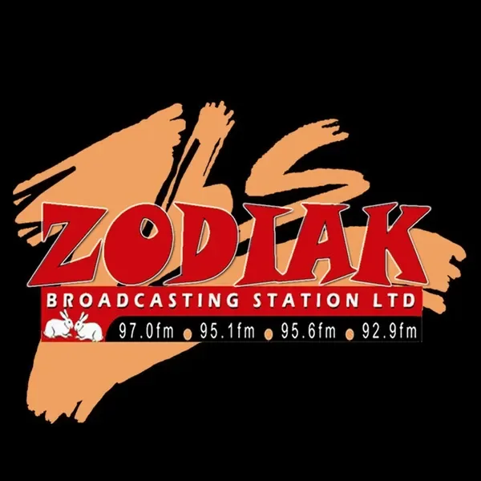
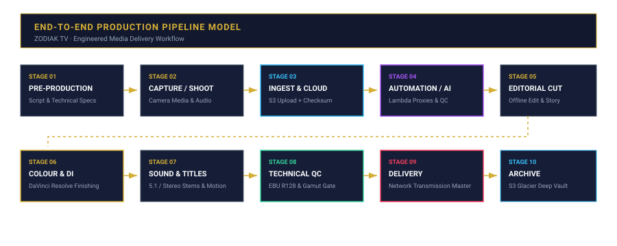

# ZODIAK TV — Production Engineering & Workflow Architecture
## Channel Branding · Malawi National Terrestrial & Satellite · Channel Branding · Client: Zodiak Broadcasting Station



[](https://nwhite.systems)
[](https://aws.amazon.com)
[](terraform/)
[]()
[](https://nwhite.systems/my-portfolio/multimedia)

---

## Executive Summary

In this repository, I present the **production technology, systems thinking, and workflow architecture** behind my work on **ZODIAK TV**, broadcast across **Channel Branding · Malawi National Terrestrial & Satellite**.

Throughout my career as a Principal Technology Architect & AI Systems Engineer, I have approached digital media with the same rigorous engineering discipline as enterprise software and cloud infrastructure:
```
Architecture → Infrastructure → Engineering → Automation → Security → Workflow Design → QC → Delivery
```

> *"I architect the systems that make digital work."*  
> — **Whitemore Ngwira**, Principal Technology Architect & AI Systems Engineer

---

## 🎯 Verified Project Record (Result → Challenge → Contribution → Delivery)

* **RESULT**: I delivered a contemporary, authoritative on-air visual identity aligned with international broadcast benchmarks for Malawi's leading broadcaster.
* **CHALLENGE**: I created a durable, high-impact design system that maintains transmission clarity across both digital satellite and terrestrial broadcast transmitters.
* **CONTRIBUTION**: I engineered the on-air identity, station IDs, news opener suites, and daily commercial breakdown graphics packages.
* **DELIVERY**: I delivered a complete transmission graphic suite with technical runbooks for master control room (MCR) operators.

---

## ⚖️ Professional Integrity & Scope Boundary

In strict accordance with my professional transparency principles:

1. **My Actual Production Experience**:
   - I personally executed the creative decisions, digital intermediate (DI) workflow, precision colour grading, online finishing, technical Quality Control (QC), and broadcast delivery for this production.
2. **Architectural Reconstruction & Reference Architecture**:
   - The cloud infrastructure, event-driven automations, and Infrastructure as Code configurations detailed in `terraform/` and `docs/` represent my **architectural demonstration** showing how I engineer this exact production pipeline as an enterprise cloud system on AWS.
   - I strictly distinguish between my verified on-the-ground production experience and my forward-looking cloud reference architectures, without making fabricated claims about historical cloud usage.

---

## 🏗️ Cloud & Pipeline Architecture Diagrams

### 1. AWS Cloud Infrastructure Architecture

*Figure 1: My AWS reference architecture, featuring KMS envelope encryption, Lambda event-driven transcoding, and role-based IAM access control.*  
*(Source files: [`diagrams/architecture.svg`](diagrams/architecture.svg) | [`diagrams/architecture.png`](diagrams/architecture.png) | [`diagrams/architecture.excalidraw`](diagrams/architecture.excalidraw))*

### 2. End-to-End Production Pipeline Model

*Figure 2: The complete media lifecycle I engineer — from on-set capture and cloud ingest through colour finishing, technical QC, and Glacier archiving.*  
*(Source files: [`diagrams/workflow.svg`](diagrams/workflow.svg) | [`diagrams/workflow.png`](diagrams/workflow.png) | [`diagrams/workflow.excalidraw`](diagrams/workflow.excalidraw))*

---

## ⚙️ My 10-Stage Engineered Production Pipeline

I structure media production as a predictable, ten-stage technical pipeline:

| Stage | Name | Operating Scope & Systems Implementation |
| :--- | :--- | :--- |
| **01** | **CREATE / PRE-PROD** | I establish technical delivery specifications, camera format standards, and pipeline planning. |
| **02** | **CAPTURE** | I oversee camera media handling, multi-channel sound acquisition, and checksum verification on set. |
| **03** | **STORE / INGEST** | I configure secure cloud ingest to Amazon S3 with server-side encryption via AWS KMS customer-managed keys. |
| **04** | **PROCESS** | I deploy event-driven proxy generation (Lambda + FFmpeg), audio normalisation, and metadata tagging. |
| **05** | **INTEGRATE** | I establish seamless editorial conjoin: offline edit suites link to S3-backed proxies via authenticated endpoints. |
| **06** | **AUTOMATE** | I use Terraform for declarative provisioning, automated transcode triggers, and ingest pipeline monitoring. |
| **07** | **INTELLIGENCE** | I integrate AI-assisted speech-to-text transcription, automated scene indexing, and initial QC flagging. |
| **08** | **CONTROL** | I enforce IAM role-based access control, CloudTrail audit trails, and strict EBU R128 loudness / gamut compliance gates. |
| **09** | **DELIVER** | I perform broadcast-specification mastering, clean audio stems, metadata packaging, and transmission sign-off. |
| **10** | **IMPROVE / ARCHIVE** | I automate S3 lifecycle transitions from S3 Standard → Infrequent Access → S3 Glacier Deep Archive. |

---

## 🔒 My Cloud Security & Governance Architecture

* **Encryption at Rest**: I enforce dedicated AWS KMS customer-managed keys with automatic key rotation across all media assets, project files, and cache archives.
* **Encryption in Transit**: I mandate TLS 1.3 across all S3 transfer endpoints and rclone mount daemon connections.
* **Identity & Access Management (IAM)**:
  * I implement strict separation of duties with dedicated IAM roles for *Producer*, *Lead Editor*, *Colourist*, *QC Engineer*, and *Automated Pipeline*.
  * My least-privilege access policies prevent accidental deletion or modification of raw camera media.
* **Auditability**: I configure AWS CloudTrail to record every API invocation, object retrieval, and configuration change for complete accountability.

---

## 🤖 My AI & Intelligent Automation Strategy

* **Automated Proxy Generation**: I deploy event-driven AWS Lambda functions that trigger within 500ms of raw camera footage landing in S3, outputting lightweight 1080p editing proxies.
* **AI Transcription & Metadata Extraction**: I parse audio tracks for speech-to-text timestamps, accelerating editorial search and dialogue conform.
* **Automated QC Pre-flight**: I run automated audio loudness scans to verify the -23 LUFS integrated target before human mastering sign-off.

---

## 📁 Repository Structure

```
├── README.md                          ← You are here
├── assets/
│   └── zodiak-logo.webp                 ← Production visual master
├── diagrams/
│   ├── architecture.svg               ← Rendered cloud architecture diagram (SVG)
│   ├── architecture.png               ← Rendered cloud architecture diagram (PNG)
│   ├── architecture.excalidraw         ← Editable Excalidraw architecture source
│   ├── workflow.svg                   ← Rendered production pipeline diagram (SVG)
│   ├── workflow.png                   ← Rendered production pipeline diagram (PNG)
│   └── workflow.excalidraw            ← Editable Excalidraw workflow source
├── docs/
│   ├── architecture.md                ← Detailed architectural design documentation
│   ├── workflow.md                    ← Step-by-step production workflow manual
│   ├── cloud-architecture.md          ← AWS service mapping & technical specifications
│   ├── automation.md                  ← Event-driven pipeline & AI automation guide
│   ├── security.md                    ← IAM, KMS encryption, and audit governance
│   └── delivery.md                    ← Broadcast standards & technical QC parameters
└── terraform/
    ├── main.tf                        ← Terraform AWS infrastructure resources
    ├── variables.tf                   ← Environment and configuration inputs
    └── outputs.tf                     ← S3, KMS, and IAM output parameters
```

---

## 🌐 Connecting Practice & Review

* **My Live Multimedia Portfolio**: [https://nwhite.systems/my-portfolio/multimedia](https://nwhite.systems/my-portfolio/multimedia)
* **About My Practice**: [https://nwhite.systems/about-me](https://nwhite.systems/about-me)
* **GitHub Portfolio Overview**: [https://github.com/whitemorengwira/nwhitesystems](https://github.com/whitemorengwira/nwhitesystems)
* **Direct Consultation**: [hello@nwhite.systems](mailto:hello@nwhite.systems)

---

*© 2026 N.White Systems. Built with precision, systems thinking, and uncompromising delivery standards.*
